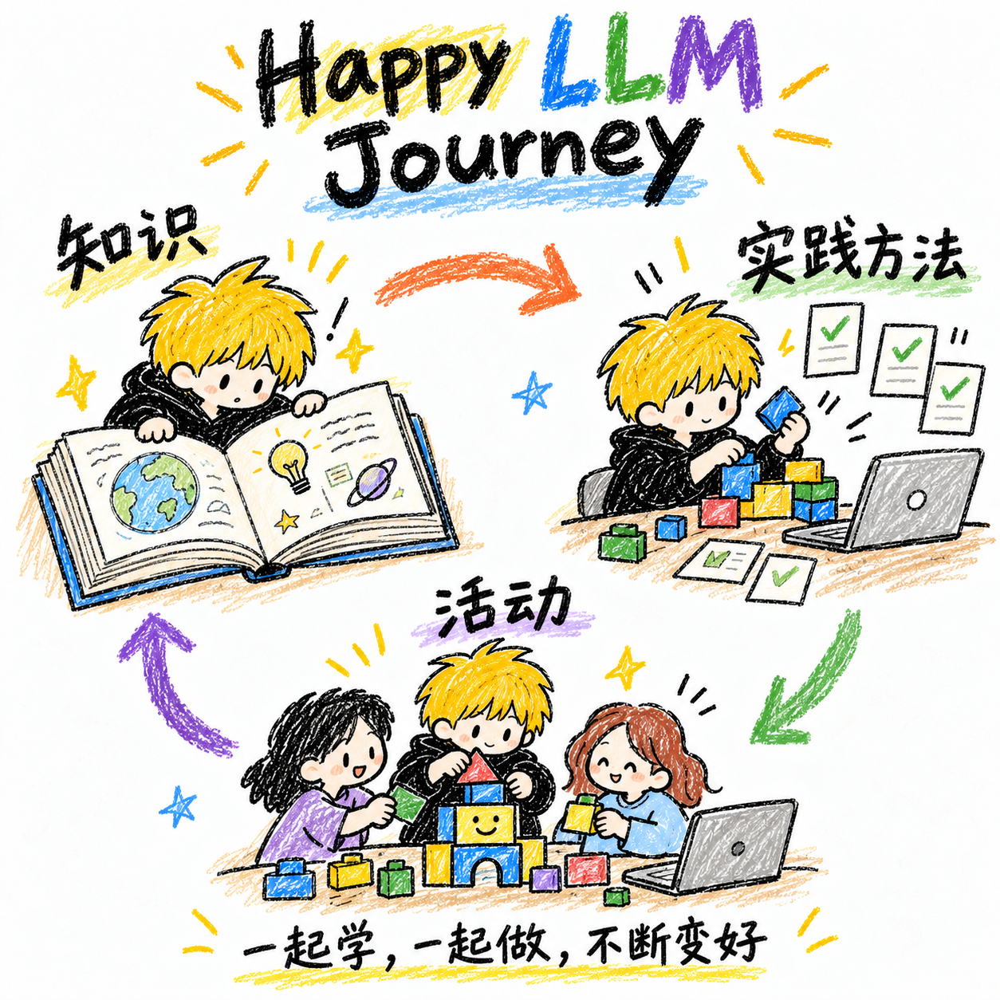

- [学习](knowledge/README.md)：积累工程与算法知识，理解原理，按需查阅。
- [最佳实践](practices/README.md)：总结真实经验，引导使用者形成自己的方法或 Skill。
- [活动](activities/README.md)：围绕任务运用方法，在实践中学习、验证和改进。

[目录总览](https://anjing-le.github.io/happy-llm-journey/overview.html)

## 目标

用 Markdown 连接维护者、使用者和各自的 Codex。使用者按目标查找知识、运用方法，不必先理解内部目录；来源、适用条件与验证状态仍可查。

知识提供理解与依据；引导类内容说明如何了解使用者、调整方法、产出并验证结果。例如 vibe coding 最佳实践，可帮助使用者结合项目与习惯形成个人方法，按需创建 Skill，再通过真实任务改进。文章本身不代表安装或执行授权。

## 维护规则

- **开始维护**：读本页和目标模块 README；设计活动时再读[共同原则](activities/DESIGN.md)。仓库文件是依据，不依赖设备、任务名称或聊天历史。
- **规划职责**：规划任务（当前为 `anjing-happy-llm-journey`）负责整体目标、对象、结构、规则与待办，评审内容及模块之间的关系；具体正文交给内容任务打磨。
- **打磨职责**：内容任务（当前为 `anjing-happy-llm-journey-do`）一次打磨一个知识条目、最佳实践或活动，与贡献者讨论、验证并成文；框架调整建议带回规划任务。名称可变，职责不变。
- **任务交接**：开始或恢复时重读本页与目标文件，先检查工作区，避免同时修改同一内容。规划交付目标、范围与文件入口；打磨回报产物、依据、待确认问题和下一步，更新下方待办。仓库记录供接续，不代表另一个正在运行的任务已收到通知。
- **内容组织**：一份内容维护一份 MD，用相对链接串联。知识仅分工程、算法，条目先平铺；最佳实践先按列表积累，按需整理，不批量生成教材或迁入历史材料。
- **写作要求**：优先短段落和列表，共同约定只写一处。区分事实、推测和经验，保留来源、适用条件、证据与限制；草稿不标成已验证。
- **文章署名**：标题下标注原创或共创、作者及链接，类型由作者或用户确认。导航、规划与模板不按文章处理。
- **公开边界**：不收录企业内部材料、凭据、个人资料、私密评审或隐藏答案。个性化资料留在使用者环境，共性经验经授权、脱敏后反馈。
- **迭代发布**：提出问题 → 打磨与验证 → 收录或修订 → 实践反馈。保留其他协作者改动，检查链接，运行 `python3 scripts/build_overview.py`，同步发布。HTML 由本页和模块 MD 生成，不另行维护正文。

## 待办

三期框架已定，尚未试跑；当前逐项打磨方法与知识。

- [ ] 为[第三期](activities/03-team-vibe-coding/README.md)选择团队任务，明确完成标准。
- [ ] 确定[第一期](activities/01-learn-llm/README.md)题目与实践安排。
- [ ] 评审[第二期设计](activities/02-how-to-vibe-coding/DESIGN.md)，选一个 coding 任务试跑，再适配旧材料。
- [ ] 结合题目明确各期参与基础与完成标准。
- [ ] 梳理工程与算法的必要知识索引，按需补内容。
- [ ] 内容打磨：[vibe coding 最佳实践](practices/codex-vibe-coding.md)。目标是引导使用者形成个人实践、按需创建 Skill；当前仅建文档，下一步从真实案例开始讨论，完成后交规划评审。
