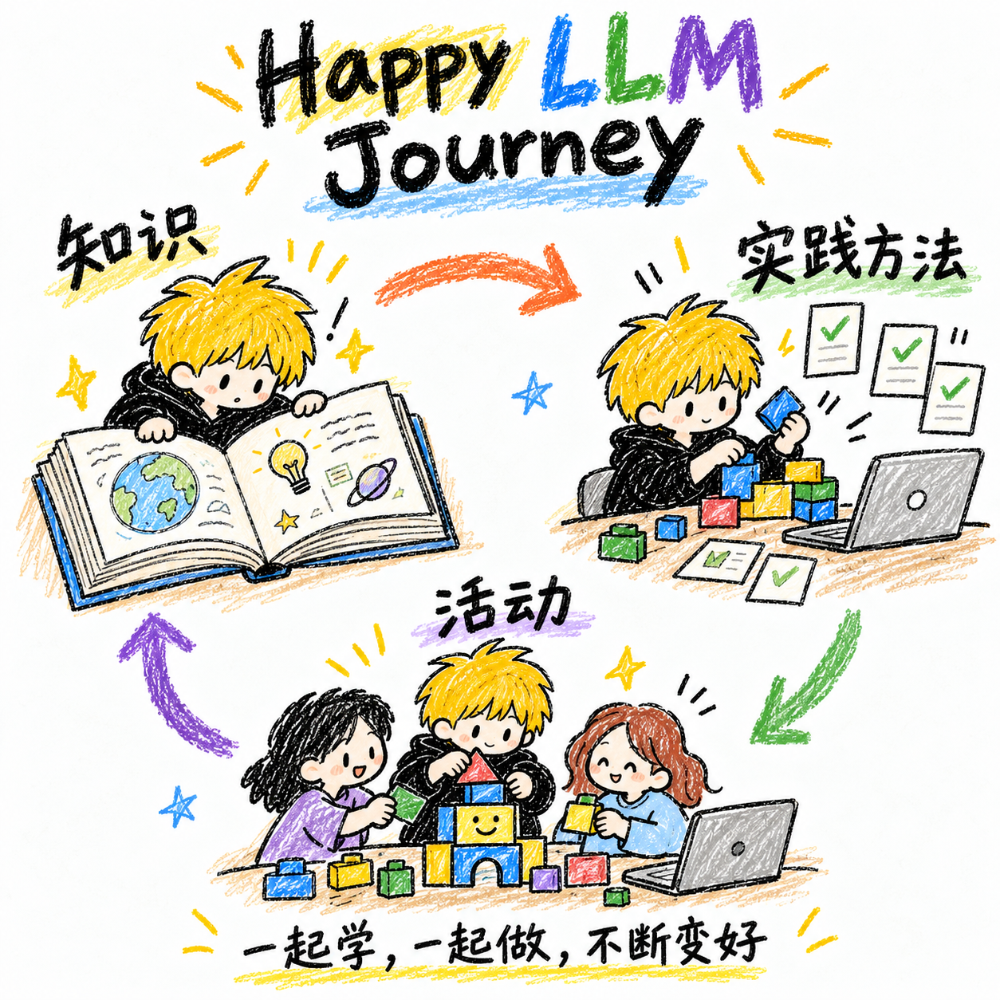

- [学习](knowledge/README.md)：积累工程与算法知识，理解原理，按需查阅。
- [最佳实践](practices/README.md)：总结真实经验，引导使用者形成自己的方法或 Skill。
- [活动](activities/README.md)：围绕任务运用方法，在实践中学习、验证和改进。

[目录总览](https://happy-llm.anjing.cc) · [GitHub Pages](https://anjing-le.github.io/happy-llm-journey/)

## 目标

Codex 是仓库与使用者之间的桥梁：先读仓库内容，再了解使用者的目标、基础与实际情况，帮助他参与合适的活动，参照最佳实践完成任务，并在过程中按需学习知识。使用者不必先理解内部目录；来源、适用条件与验证状态仍可查。

知识提供理解与依据；引导类内容说明如何了解使用者、调整方法、产出并验证结果。例如 vibe coding 最佳实践，可帮助使用者结合项目与习惯形成个人方法，按需创建 Skill，再通过真实任务改进。文章本身不代表安装或执行授权。

## 维护规则

- **协作流程**：按 [AGENTS.md](AGENTS.md) 在同一任务中推进框架设计、逐项打磨与使用反馈；设计活动时参考[共同原则](activities/DESIGN.md)。
- **接续记录**：下方待办保留目标、文件入口、实际进度和下一步，便于换设备、换任务或协作者加入后继续。
- **内容组织**：一份内容维护一份 MD，用相对链接串联。知识仅分工程、算法，条目先平铺；最佳实践先按列表积累，按需整理，不批量生成教材或迁入历史材料。
- **写作要求**：优先短段落和列表，共同约定只写一处。区分事实、推测和经验，保留来源、适用条件、证据与限制；草稿不标成已验证。
- **文章署名**：标题下标注原创或共创、作者及链接，类型由作者或用户确认。导航、规划与模板不按文章处理。
- **公开边界**：不收录企业内部材料、凭据、个人资料、私密评审或隐藏答案。个性化资料留在使用者环境，共性经验经授权、脱敏后反馈。
- **页面来源**：`web/` 前端构建时读取本页和模块 MD，自动生成目录、说明与阅读页面；不另行维护正文或生成文件。同步步骤见 [AGENTS.md](AGENTS.md)。

## 开发与发布

内容与前端在同一仓库，各自维护：三个模块存 MD，`web/` 存 React、TypeScript 与 Vite 前端。本地需要 Node.js 22.12 或更新版本。

```sh
npm ci
npm run dev     # 本地开发，修改 MD 自动更新页面
npm run build   # 检查内容链接、类型，构建到 dist/
npm run preview # 预览构建结果
```

`main` 更新后，GitHub Actions 通过部署钩子触发 Cloudflare Pages，发布到 [happy-llm.anjing.cc](https://happy-llm.anjing.cc)，同时发布 GitHub Pages。旧 `/overview.html` 地址保留。阅读页包含完整静态正文，并提供 Markdown 原文，方便把链接交给 Codex。

## 待办

三期框架已定，尚未试跑；当前逐项打磨方法与知识。

- [ ] 为[第三期](activities/03-team-vibe-coding/README.md)选择团队任务，明确完成标准。
- [ ] 对照[外部提纲参考](activities/01-learn-llm/EXTERNAL-OUTLINE.md)及后续材料，确定[第一期](activities/01-learn-llm/README.md)题目与实践安排；以活动目标取舍，不按课程目录堆内容。
- [ ] 评审[第二期设计](activities/02-how-to-vibe-coding/DESIGN.md)，选一个 coding 任务试跑，再适配旧材料。
- [ ] 结合题目明确各期参与基础与完成标准。
- [ ] 梳理工程与算法的必要知识索引，按需补内容。
- [ ] 内容打磨：[vibe coding 最佳实践](practices/codex-vibe-coding.md)。面向企业级项目的个人开发；现有使用说明与定制引导为草稿，核心方法未完成、尚未试用。先按用户想法制作个人 Skill，在真实任务中试用，再据此完善使用与定制指引。
